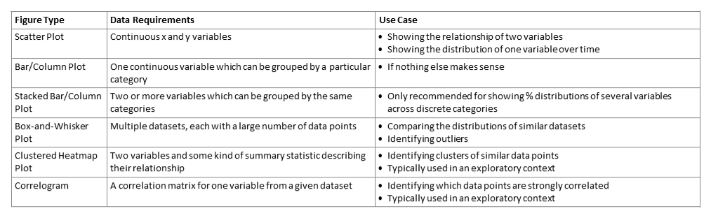

# Choosing an Appropriate Visualization


## Quick Summary


{width=100%}

## Box and Whisker Plots

This type of plot requires at least 5 (and ideally many more) data points in each grouping or category. The most common use case you'll encounter is where you want to show the consistency of your instrumental method for specific compounds across multiple samples (or quickly identify statistical outliers). As an example, I'll use some house dust mass spectrometry data where I was looking for chlorinated azo dyes. 

```{r}
library(tidyverse)
ClAzoData<-read_csv("data/ChlorAzodyesLog.csv")

ClAzoData<-ClAzoData %>%
  pivot_longer(cols = -c("CpdID","Formula","mz","RT"), names_to = "Sample", values_to = "Log_Intensity") %>%
  group_by(CpdID) 

ClAzoBox<-ggplot(data = ClAzoData, mapping=aes(x=CpdID, y=Log_Intensity, group=CpdID))+
  geom_boxplot()+
  xlab("Compound ID#")+
  ylab("Log Peak Intensity")
print(ClAzoBox)
```

```{r}
ClAzoData<-ClAzoData %>%
  filter(Log_Intensity>0)
  
ClAzoBox<-ggplot(data = ClAzoData, mapping=aes(x=CpdID, y=Log_Intensity, group=CpdID))+
  geom_boxplot()+
  xlab("Compound ID#")+
  ylab("Log Peak Intensity")
print(ClAzoBox)

```

```{r}
ClAzoData<-ClAzoData %>%
  mutate(MedInt = median(Log_Intensity))
  
ClAzoBox<-ggplot(data = ClAzoData, mapping=aes(x=reorder(CpdID, -MedInt), y=Log_Intensity, group=CpdID))+
  geom_boxplot()+
  theme_classic()+
  xlab("Compound ID#")+
  ylab("Log Peak Intensity")
print(ClAzoBox)

```