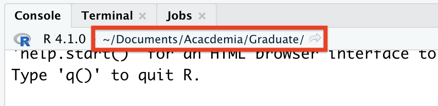

# R Studio Projects

You're probably eager to start coding, but an equally important aspect is understanding the structure of your work. Knowing how to organize the files needed for your analysis and how to access them quickly is critical and learning this format early on will save you plenty of time and heartache down the line. So let's hold off on coding and consider *where* we're working on your computer.

Because we believe in it so much, we'll say it up top: **Always work inside an RStudio Project, and use a unique project for each lab/experiment.**

## Paths and directories

Before we get started with running any code, it is good to know where our analysis is actually occurring, or where your **working directory** is. The working directory is the folder where R looks for files that we have asked it to import, and the folder where R stores files that we have asked it to save. 

RStudio displays the current working directory at the top of the console, as shown below, but can also be printed to the console using the command `getwd()`.



By default, R usually sets the working directory to the home directory on your computer. The `~` symbol denotes the home (or "root") directory, and can be used as a shortcut when writing a file path that references the home directory. 

To make things easier on ourselves, we'll be doing all of our work in RStudio within an **R project**. When we create an R project, R sets the working directory to a file folder of our choice. Any files that our code needs to run (i.e., data sets, images, etc.) are placed within this folder. We can then use relative paths to refer to data files in the project folder, which is much more conducive to sharing code with colleagues, TAs, and Profs. 

## Importing the R4EnvChem Project

While you can create a project from scratch (discussed below), we've created a draft project template. Download it, and you'll have a working RStudio project that you can use as you follow along with the code in the rest of this chapter and the tutorial exercise. 

  1. Downloading the template project from the [GitHub repository here](https://github.com/DavidRossHall/R4EnvChem-ProjectTemplate); there are instructions on downloading at the bottom of the repositories webpage. Unzip the project folder somewhere useful/that makes sense to you (i.e. a folder for schoolwork).
  2. From RStudio click `File` -> `Open Project...` and open the `R4EnvChem-ProjectTemplate.Rproj` file. 
  
If you've followed the steps above you should have successfully downloaded and opened an RStudio project, and it should look like this: 


  
Note how the project name is displayed on the top right. We can quickly switch between projects here, which is useful if you'll be using R for many different labs/courses. As well, take note that the working directory has changed to the one where the RStudio project is located.  Since we've downloaded the entire project, the working directory for the project includes the example scripts and data files we'll need to continue along with the remainder of this book. If we open up the project folder (or access it from the `Files` tab) it should look like this: 

```
R4EnvChem-ProjectTemplate
│   R4EnvChem-ProjectTemplate.Rproj
|   README.md
|   Rmarkdown-example.rmd
|   Rmarkdown-example.pdf
│   Rscript-example.R
|
└───data
│       2018-01-01_60430_Toronto_ON.csv
│       2018-01-01_60512_Hamilton_ON.csv
│       2018-01-01_60610_Sudbury_ON.csv
│       2018-07-01_60430_Toronto_ON.csv
│       2018-07-01_60512_Hamilton_ON.csv
│       2018-07-01_60610_Sudbury_ON.csv
|       Airbeam - Hart House Cardio Room.csv
|       Airbeam2 July 25.csv
|       ATR_plastics.csv
|       FAESdata.csv
│    
└───images
    │   DHall_TorontoPano.jpg
```

As you can see, the R4EnvChem-ProjectTemplate.Rproj file is located in the main folder, which RStudio will now treat as the root directory. We’ll learn why this matters in more detail in a future chapter, but essentially it means we’ll be able to quickly access files in project subfolders such as data and images without having to find out what the full file path is for your own computer. 

As an example, the file path for DHall_TorontoPano.jpg might normally be written as:
“/Users/Desktop/Documents/R4EnvChem/R4EnvChem-ProjectTemplate-main/R4EnvChem-ProjectTemplate-main/images/DHall_TorontoPano.jpg”

However, with our R Project defining a new root folder, we can instead use:
“images/DHall_TorontoPano.jpg””
 

In the future you can create your own projects from scratch, but it we'd recommend follow the folder layout of the template provided. Having consistently named folders you'll use in every project will help simplify our lives down the road. 

## Summary

In this chapter we've covered: 

  - Importing the *R4EnvChem Project Template* so we have access to data for the tutorial (among other things)
  - The concept of paths and directories and how relative referencing withing a project greatly simplify this

We'll preach more about the usefulness of projects later on, but now that we've gotten a working project with some data, let's move onto Chapter 2 so we can start actually coding. 

---------------------------


## Bonus Info: Creating a Blank RStudio project

To create a new RStudio project from scratch: go to *File*->*New Project*, or click the button highlighted in the image below. Click *New Directory*, then *New Project*. 


You may want your project directory to be a sub-folder of an existing directory on your computer which already contains your data sets. If this is the case, click *Existing Directory* instead of *New Directory* at the previous step, and then select the folder of your choice.

Next, you'll be asked to choose a sub-directory name and location. Enter your selected name and choose an appropriate location for the folder on your computer. Click *Create Project*, and you should now see your chosen file path displayed in Files tab of the Viewer pane:


As mentioned previously, you can also view the file path to your project directory using `getwd()`. The output should match the file path shown in Viewer pane.

When working on assignments for coursework, it is good practice to create a new R project for each assignment you work on. You should store the data, images, and any other files required for that assignment within the folder for the designated R project. You can create sub-folders for data and images, however, you may want to avoid making too many nested sub-folders, as this will make your paths long and tiresome to type. For a hypothetical course with 5 Labs (*cough* CHM410 *cough*), your coursework would look like this:


```
CHM410
|
└─── Project 1
|     |
|     |   project1.Rproj
|     |   project1WriteUp.Rmd
|     └───data
|     │     ...
|     └───images
|           ...
|
└─── Project 2
      |
      |   project2.Rproj
      |   project2WriteUp.Rmd
      └───data
      │     ...
      └───images
            ...
...
```

With a separate folder for each experiment, and within each folder is an RStudio project, data, images, and other files required for *that* specific project. You shouldn't have nested R studio project as their is no benefit to this approach. Keep everything you need in one location, and no more. 
