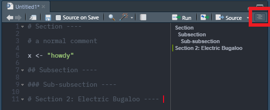

# Working With Scripts

We've already mentioned the *environment* pane that displays objects present in your current R session. While they are useful to work with in the console, they're not *real*. That is to say, if we closed our R session, those objects would be lost. And while RStudio does allow us the option to save a working environment (and its associated objects) between sessions, it's best to always use a **Script**. 

Scripts are essentially a recipe that R reads to execute instead of you typing and running each line of code. And like a recipe, R reads our script from top to bottom. An important aspect of scripts is that they're *reproducible*. In other words, we should be able to rerun our script and get the exact same result every time. 

Essentially, relying solely on the working environment is like trying to memorize your lab experiment observations for later, while using scripts is like immediately writing those observations down in your lab notebook. I shouldn't have to tell you which method is more reliable.


## Creating or opening a script

To create a script: 

  1. Go to `File` -> `New File` -> `R Script`. This will open the Scripts pane above the console (see image below).
  2. Then immediately save your new script by going to `File` -> `Save As...`. 
    a. Make sure to save your file with the `.R` suffix.
    b. **Save your script in your main project folder**, otherwise you'll run into issues.

{width=100%}

We've also provided an example script in the R4EnvChem project template. Assuming you're currently in the template project you can open the script as follows:

  1. Go to `File` -> `Open File` -> open the `Rscript-example.R` file. Or, navigate to the `Files` tab of the Viewer pane and click the `Rscript-example.R` file to open it.
  
To run code, use your mouse to highlight the lines you wish to run and either click `Run` at the top of the script pane or press `Ctrl+Enter` (`Cmd+Enter` on Mac). Only the selected lines will be run. You'll see the lines appear in the console, followed by the output if there is any.


## Saving R scripts

At this point in the chapter, two things should be clear: 

1. Only R scripts saved to `.R` files are real. 
2. Objects in the working environment are not real, and will not be readily available after you close and re-open RStudio.

So what is important to save in R, and how often should we save these files? 

It is paramount that we save the scripts you code in, and that we save them *regularly*. Even if we've made small notation changes to the code, it is always a good idea to save our changes to the script before closing RStudio, as there is a good chance you will not remember the minor differences upon returning. We want to make sure that even if we lose an object in our environment, our script still contains the code we used to generate that object. We also want to make sure that we generate the object before it gets called, so that when we run our scripts from top-to-bottom, the variables are generated in the working environment before they are referenced by later commands. 


## Script formatting

You should now be familiar with how to open the Scripts window, as well as some of the advantages of typing your code into this window rather than into the console directly. Before you write your first script, let's review some basic script formatting. 

Before we enter any code into our script, it is good practice to fill the first few lines with text comments which indicate the script's title, author, and creation or last edit date. We can create a comment in a script by typing `#` before the text. Here's an example from the top of `Rscript-example.R`.

```{r}
#Title: Ozone time series script
#Author: Georgia Green
#Date: January 8, 2072
```

Below our script header, we should include any packages that need to be loaded for the script to run. Including the necessary packages at the top of the script allows you, and anyone you share your code with, to easily see what packages they need to install. This also means that if you decide to run an entire script at once, the necessary packages will always be loaded before any subsequent code that requires those packages to work. 

The first few lines of your scripts should look something like the following.

```{r eval = FALSE}
# Title: Example R Script for Visualizing Air Quality Data 
# Author: John Guy Rubberboots
# Date: 24 June 2021

# 1. Packages ---- 

# Install and open tidyverse if you haven't already 

#install.packages("tidyverse")

library(tidyverse)


```

The rest of your script should be dedicated to executable code. It is good practice to include text comments throughout the script, in between different chunks of code, to remind yourself what the different sections of code are for (i.e., `#1. Packages` in the above example). This also makes it easy for anyone you share your code with to understand what you're trying to do with different sections within the script.

We can also use headers and sub-headers in your scripts using `#`, `##`, and `###` before our text and `----` after as shown below:
```{r, eval = FALSE}
# Section ----
## Subsection ----
### Sub-subsection ----
```

Headings and subheadings are picked up by RStudio and displayed in the Document Outline box. You can open the Document Outline box by clicking the button highlighted in the image below. Use of these headings allows easy navigation of long scripts, as you can navigate between sections using the Document Outline box. 


{width=100%}

## Viewing data and code simultaneously

Once we start working with large datasets, you may find yourself wanting to be able to to view your scripts and data side-by-side. You can open a script, plot, or dataset in a new window by clicking and dragging the tab in RStudio (may not be compatible with Mac), or by clicking the button highlighted in the image below. 

{width=100%}

Now that we're familiar with navigating RStudio and some basic coding building blocks, let's move over to Chapter 3, where we'll review a normal workflow in R.


## Summary

In this chapter we've covered:

  - R workflows in the context of projects and scripts
  - What's considered *real* when working in RStudio
  - How to format our scripts for legibility (Remember you're the one who's going to be stuck rereading it!)
  
Now that you're familiar with the above, we'll introduce RMarkdown, a way to combine your R code, it's outputs, and your writing all in one dynamic document (like your lab reports!).  
